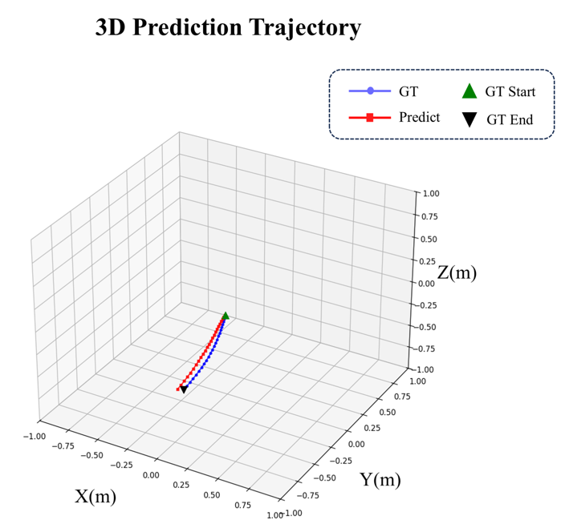
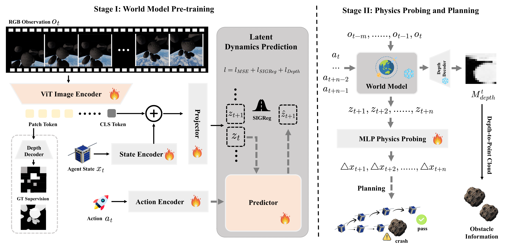

  

<h1 align="center"><strong>Orbit-Planner: Towards Latent World Models for On-Orbit Obstacle Avoidance of Satellite Agent</strong></h1>

  <strong><a href="https://zhijianli2003.github.io/">Zhijian Li</a></strong> · Chao Ren* · Peijin Wang · Xian Sun  
  Aerospace Information Research Institute, Chinese Academy of Sciences (AIRCAS) 

  
  &nbsp;
  

## News

- [2026/07/11] 🔥 We release **Orbit-Planner** training & evaluation code, along with Stage 1 & Stage 2 pre-trained checkpoints. [Code](https://github.com/ZhijianLi2003/Orbit_Planner) [Checkpoints](https://huggingface.co/datasets/warriorLZJ/Orbit_Planner/tree/main)
- [Coming Soon] **Orbit-Planner** arXiv preprint will be available soon. [Paper](https://arxiv.org/abs/0000.00000)

## Demo

  
  

<!-- ## Framework

  

Orbit-Planner is a two-stage latent world model for on-orbit obstacle avoidance:

- **Stage 1**: RGB observations and proprioceptive states are encoded into latent dynamics; an AdaLN Transformer predicts future latents with auxiliary depth supervision.
- **Stage 2**: A physics-inspired prober maps frozen latent rollouts to interpretable spacecraft states for planning and control. -->
